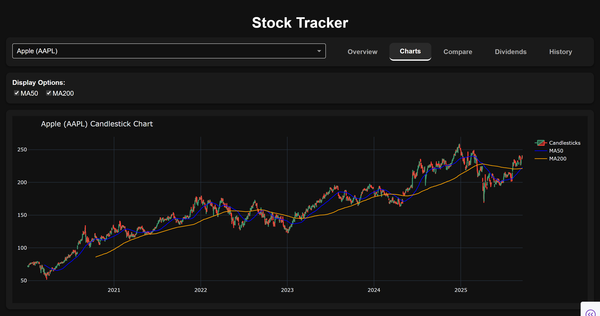

# Stock Analyzer Dashboard

An interactive stock analysis tool built with **Python, Plotly, and Dash**.  
This project is designed to demonstrate **data analysis, visualization, and financial insight**

---

## Features
- Fetch live stock data using [yfinance](https://pypi.org/project/yfinance/)
- Interactive charts
- Technical indicators (Moving averages, e.t.c)
- Risk & performance metrics:
  - P/E Ratio
  - Beta
  - Volume
  - Analyst Opinion
  - e.t.c.
- Dash app for web view

---

## Example Visualizations

---

## Tech Stack
- **Python 3.9+**
- **Plotly** – interactive charts
- **Pandas** – data editing
- **Dash** – web app framework
- **yfinance** – stock data
- **yahooquery** - dynamic search queries
---